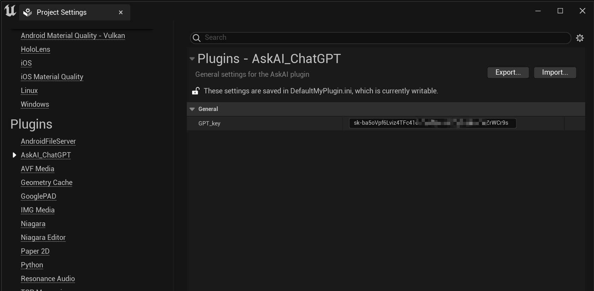
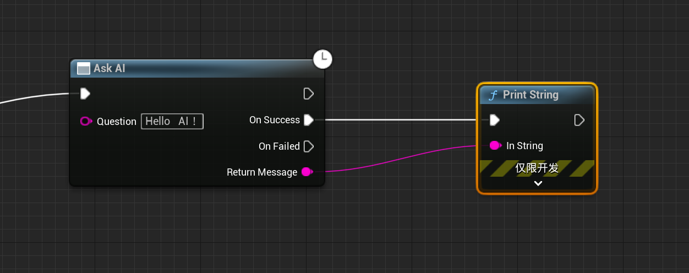

</img>

<h1 align="center" style="font-size:50px;font-weight:bold">AskAI</h1>

chatGPT plugin for ue5

    
     
    

# AskAI Usage:
</img>
 
</img>

# Video
<a href="https://www.acfun.cn/v/ac41014214">演示视频</a>